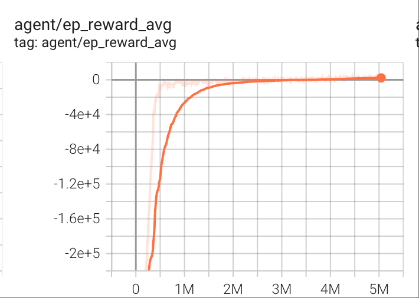
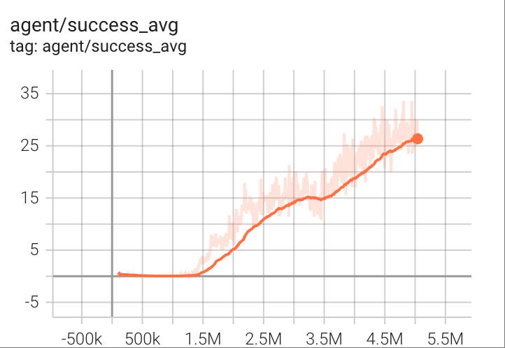

# Right-of-way RL 🚗💨

<div align="center">

**OPTIMA: Optimized Policy for Intelligent Multi-Agent Systems Enables Coordination-Aware Autonomous Vehicles**

[](https://ieee-itsc.org/)
[](https://www.python.org/downloads/)
[](https://pytorch.org/)
[](https://github.com/metadriverse/metadrive)

*🎉 Accepted at IEEE ITSC 2025*

</div>

## 📄 Overview

This work presents a **distributed multi-agent reinforcement learning system** for autonomous vehicles in intersection scenarios, focusing on right-of-way coordination and safety-aware decision making. While designed for large-scale distributed training, we provide a **single-host version for quick experimentation and research reproducibility**.

## ✨ Key Features

- 🤝 **Multi-Agent Coordination**: Advanced right-of-way learning with neighbor reward mechanisms
- 🔄 **Distributed by Design**: Scalable architecture supporting multi-GPU and multi-host deployment
- ⚡ **Quick Start**: Single-host version for rapid prototyping and research
- 🛡️ **Safety-Aware**: Built-in safety constraints with collision avoidance
- 🎮 **Multiple Algorithms**: Support for PPO, SAC, and DDPG reinforcement learning algorithms
- 📊 **Proven Results**: 100% success rate (40/40 vehicles) in complex intersection scenarios

## Installation

``` bash
pip install uv
uv sync

source .venv/bin/activate
python -m metadrive.pull_asset # or download from https://github.com/metadriverse/metadrive/releases/download/MetaDrive-0.4.3/assets.zip to .venv/lib/python3.10/site-packages/metadrive/assets.zip and unzip it.
```


## 🚀 Quick Start

### Single-Host Training (Recommended for Quick Setup)

```bash
PYTHONPATH=. python main.py --config-name single_host_ppo
```

**Hardware For Test**: 1 GPU V100 + 44 cores × 2 CPUs

**Quick Results**:
- ⏱️ **3 hours** → 5 million training samples
- 🎯 **Success Rate**: 30/40 vehicles (75%) reach destination
- 📈 **Improvement**: Performance continues to improve with longer training

#### Training Curves

<div align="center">

| Episode Reward Progression | Success Rate Improvement |
|:---------------------------:|:-------------------------:|
|  |  |

*Figure: TensorBoard training curves showing episode reward reaching ~2,784 and success rate improvement over 5 million training samples on single V100 GPU.*

</div>

> 💡 **Tip**: This single-host version is specifically designed for researchers who want to quickly reproduce our results without setting up a distributed system. The distributed version offers even better scalability for production use.

### Distributed Training (For Production Scale)

For large-scale experiments and production deployment, use the distributed version:

#### 1. Configure Network Settings
```yaml
# drrl/configs/ppo.yaml - Update with your actual server IP
name_server:
  ip: "your_actual_ip"  # Replace with your server IP address
```

#### 2. Start Training Server
```bash
PYTHONPATH=. python server.py --config-name ppo
```

#### 3. Launch Worker Clients
```bash
PYTHONPATH=. python client.py --config-name ppo
```


## 📚 Citation

If you use this work in your research, please cite our IEEE ITSC 2025 paper:

```bibtex
@inproceedings{du2025optima,
  title={OPTIMA: Optimized Policy for Intelligent Multi-Agent Systems Enables Coordination-Aware Autonomous Vehicles},
  author={Du, Rui and Zhao, Kai and Hou, Jinlong and Zhang, Qiang and Li, Tianjiao and Zhang, Peter},
  booktitle={2025 IEEE 28th International Conference on Intelligent Transportation Systems (ITSC)},
  year={2025}
}
```

## 🤝 Contributing

We welcome contributions! Please feel free to submit issues and pull requests to help improve this research codebase.

## 📄 License

This project is licensed under the MIT License - see the LICENSE file for details.

## 🙏 Acknowledgments

- **MetaDrive Team** for providing the excellent simulation environment
- **IEEE ITSC 2025** for accepting our research contribution
- **Open Source Community** for supporting reproducible research

---

<div align="center">

**🌟 If this work helps your research, please consider starring this repository! 🌟**

*Distributed Multi-Agent RL for Autonomous Driving • IEEE ITSC 2025*

</div>
